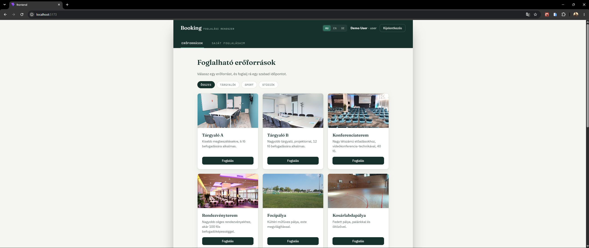
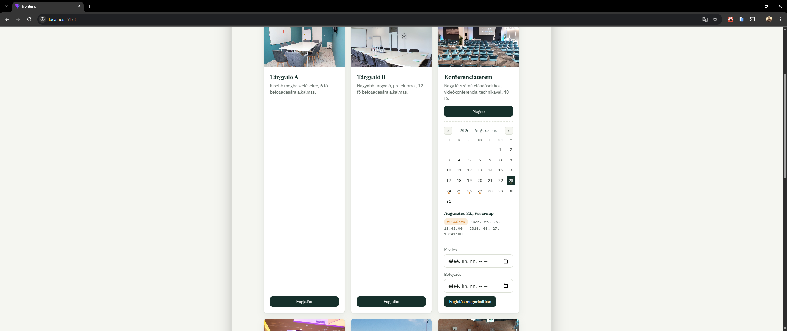
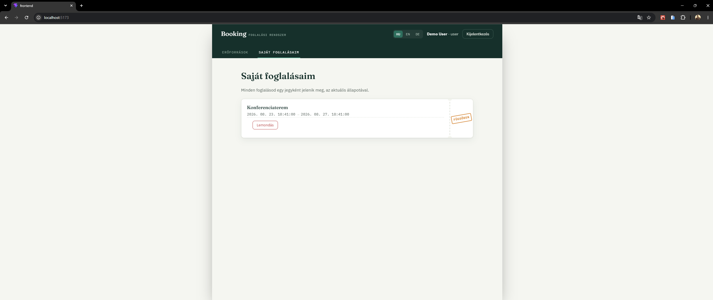
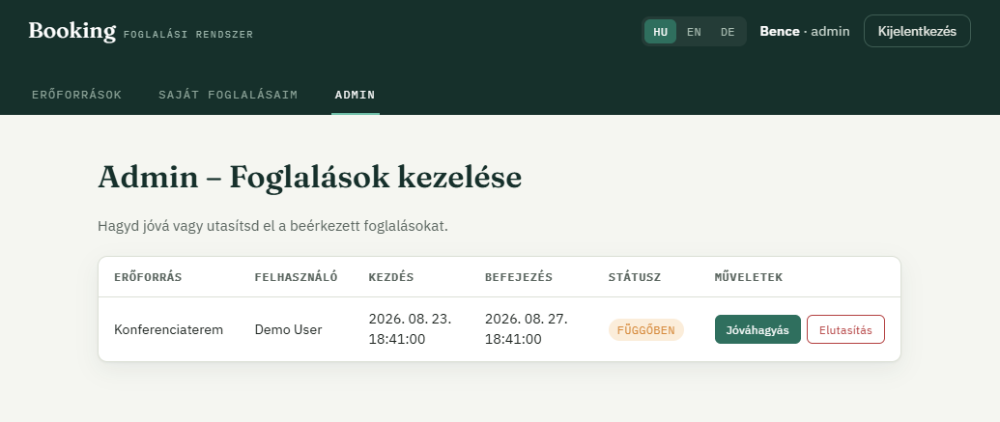
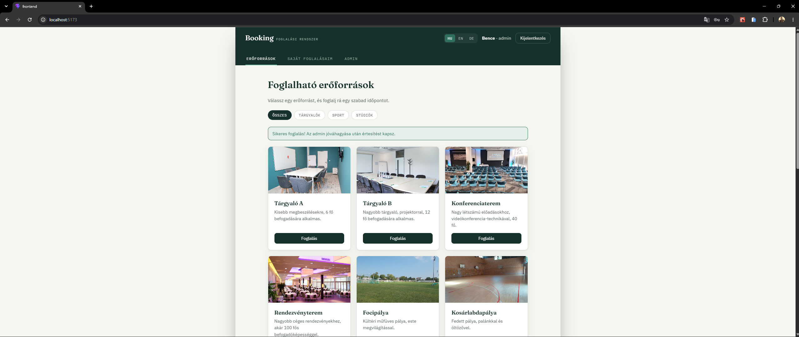
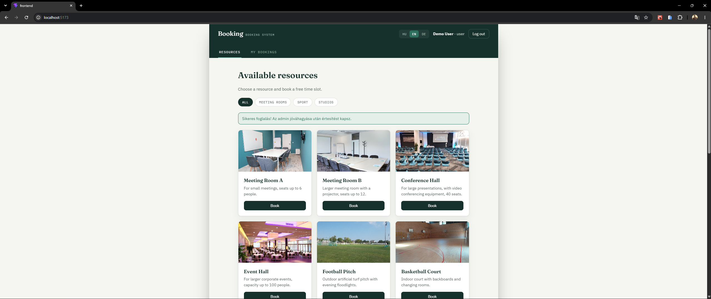
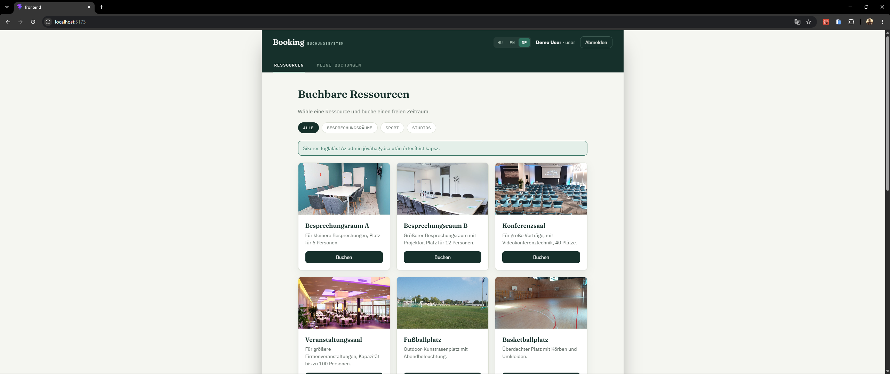

# Booking App

Fullstack foglalási rendszer, ahol a felhasználók erőforrásokat (tárgyalókat, sportpályákat, stúdiókat) foglalhatnak, az adminok pedig jóváhagyják vagy elutasítják a beérkező foglalásokat.

## Demo hozzáférés

A projekt seedelt demo fiókokkal érkezik, hogy admin szerepkörben is ki lehessen próbálni:

| Szerepkör | Email | Jelszó |
|---|---|---|
| Admin | `admin@example.com` | `password` |
| Felhasználó | `user@example.com` | `password` |

## Élő demo

🔗 **[booking-system-ochre-alpha.vercel.app](https://booking-system-ochre-alpha.vercel.app)**

> Nyilvános demo-környezet – a fenti demo hozzáférési adatokkal bárki kipróbálhatja, beleértve az admin felületet is.
**Megjegyzés:** a demo-környezet email-küldése SendGrid-en keresztül működik, saját domain hiányában előfordulhat, hogy a visszaigazoló email a Spam mappába kerül.

## Funkciók

- **Regisztráció / bejelentkezés** – token-alapú authentikáció (Laravel Sanctum)
- **Foglalható erőforrások** – 14 db, képekkel, kategóriákkal (tárgyalók / sport / stúdiók), szűrhető lista
- **Naptár nézet** – az adott erőforrás foglaltsága havi bontásban, mielőtt időpontot választanál
- **Foglalás ütközés-ellenőrzéssel** – nem lehet két foglalás ugyanarra az időpontra ugyanazon erőforráson
- **Saját foglalásaim** – áttekintés, lemondási lehetőséggel
- **Admin felület** – beérkező foglalások jóváhagyása / elutasítása
- **Email értesítés** – automatikus visszaigazolás foglaláskor és admin döntéskor (SMTP-n keresztül)
- **Többnyelvű felület** – magyar / angol / német
- **Automatizált tesztek** – 12 Feature teszt (auth, ütközés-ellenőrzés, jogosultságkezelés)

## Tech stack

**Backend:** PHP, Laravel, Laravel Sanctum, PostgreSQL (Supabase), Eloquent ORM
**Frontend:** React, JavaScript (ES Modules), Vite
**Egyéb:** PHPUnit (automatizált tesztek), egyedi fordítási (i18n) réteg, saját design-rendszer

## Architektúra

```
booking-app/
├── backend/          Laravel API (MVC felépítés)
│   ├── app/Http/Controllers/
│   ├── app/Models/
│   ├── database/migrations/
│   ├── database/seeders/
│   └── tests/Feature/
└── frontend/         React SPA
    ├── src/api/          API hívások (fetch réteg)
    ├── src/context/      Globális állapot (Auth, Language)
    ├── src/components/   UI komponensek
    └── src/i18n/         Fordítási szótár
```

## Helyi futtatás

### Előfeltételek
- PHP 8.2+, Composer
- Node.js + npm
- Egy PostgreSQL adatbázis (pl. ingyenes [Supabase](https://supabase.com) projekt)

### Backend

```bash
cd backend
composer install
cp .env.example .env
php artisan key:generate
```

Írd be a `.env` fájlba a saját adatbázis-kapcsolati adataidat (`DB_CONNECTION=pgsql`, `DB_HOST`, `DB_PORT`, `DB_DATABASE`, `DB_USERNAME`, `DB_PASSWORD`).

```bash
php artisan migrate
php artisan db:seed
php artisan serve
```

A backend ezután fut: `http://127.0.0.1:8000`

### Frontend

```bash
cd frontend
npm install
npm run dev
```

A frontend ezután fut: `http://localhost:5173`

### Tesztek futtatása

```bash
cd backend
php artisan test
```

## Screenshotok

### Erőforrások


### Naptár nézet


### Saját foglalásaim


### Admin felület


### Többnyelvű felület

<p>
  
  
</p>
